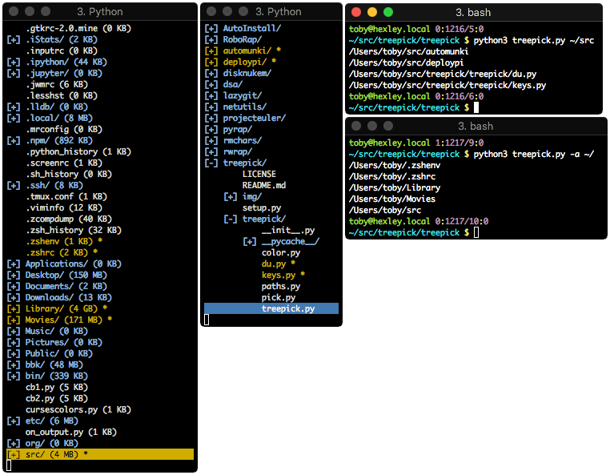

# CURSES TREE STYLE PATH PICKER

A Curses based, tree style, path picker. For use as a terminal based file dialog.



* Pre-order file system traversal from a given point, or `$PWD` if not specified.
* Expand or collapse child nodes one at a time or all at once.
* Recursively get disk usage of a single node or all expanded nodes.
* Toggle display of dotfiles.
* Toggle marking of files that can then be piped into another program or simply
  echoed back to the screen upon exit.
* Reset marking and expansion.

```
USAGE: treepick [-h] [-a] [path]

Select paths from a directory tree.

POSITIONAL ARGUMENTS:
path          A valid path.

OPTIONAL ARGUMENTS:
-h, --help    Show this help message and exit.
-a, --hidden  Show all hidden paths too.
```

## KEYBINDINGS

| Key         | Action                                                  |
|:------------|:--------------------------------------------------------|
| UP, k, p    | Go up one line.                                         |
| DOWN, j, n  | Go down one line.                                       |
| RIGHT, l, f | Expand child node, and move down one line (into child). |
| LEFT, h, b  | Collapse child node.                                    |
| Tab         | Toggle expansion/collapse of child node.                |
| PGDN, d, v  | Move down a page of lines at a time.                    |
| PGUP, V, u  | Move up a page of lines at a time.                      |
| J, N        | Move to next child node, of parent. (needs some TLC!)   |
| K, P        | Move to parent node. (also currently pretty broken!)    |
| g, <        | Move to first line.                                     |
| G, >        | Move to last line.                                      |
| m, SPC, RET | Toggle marking of paths.                                |
| .           | Toggle display of dotfiles.                             |
| s           | Display total size of path, recursively                 |
| S           | Display, totol size of all currently expanded paths.    |
| r           | Reset marking and expansion.                            |
| q, e, ESC   | Quit and display all marked paths.                      |
