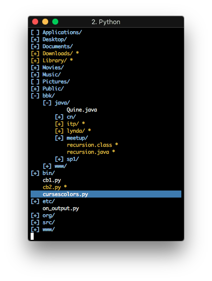
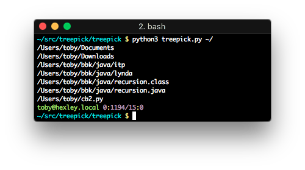

# CURSES TREE STYLE PATH PICKER

A Curses based, Tree style, Path Picker. For use as a terminal based file dialog
library.





-   Pre-order file system traversal from a given point, or `$PWD` if not specified.
-   Expand or collapse child nodes one at a time or all at once.
-   Recursively get disk usage of a single node or all expanded nodes.
-   Toggle display of dotfiles.
-   Toggle marking of files that can then be piped into another program or simply
echoed back to the screen upon exit.
-   Reset marking and expansion.

```
**USAGE:** treepick.py [-h] [-a] [path]

*Select paths from a directory tree.*

**POSITIONAL ARGUMENTS:**
path          A valid path.

**OPTIONAL ARGUMENTS:**
-h, --help    show this help message and exit
-a, --hidden  Show all hidden paths too.
```

## KEYBINDINGS

<table border="2" cellspacing="0" cellpadding="6" rules="groups" frame="hsides">

<colgroup>
<col  class="org-left" />
<col  class="org-left" />
</colgroup>
<thead>
<tr>
<th scope="col" class="org-left">Key</th>
<th scope="col" class="org-left">Action</th>
</tr>
</thead>

<tbody>
<tr>
<td class="org-left">UP, k, p</td>
<td class="org-left">Go up one line.</td>
</tr>


<tr>
<td class="org-left">DOWN, j, n</td>
<td class="org-left">Go down one line.</td>
</tr>


<tr>
<td class="org-left">RIGHT, l, f</td>
<td class="org-left">Expand child node, and move down one line (into child).</td>
</tr>


<tr>
<td class="org-left">LEFT, h, b</td>
<td class="org-left">Collapse child node.</td>
</tr>


<tr>
<td class="org-left">Tab</td>
<td class="org-left">Toggle expansion/collapse of child node.</td>
</tr>


<tr>
<td class="org-left">PGDN, d, v</td>
<td class="org-left">Move down a page of lines at a time.</td>
</tr>


<tr>
<td class="org-left">PGUP, V, u</td>
<td class="org-left">Move up a page of lines at a time.</td>
</tr>


<tr>
<td class="org-left">J, N</td>
<td class="org-left">Move to next child node, of parent. (needs some TLC!)</td>
</tr>


<tr>
<td class="org-left">K, P</td>
<td class="org-left">Move to parent node. (also currently pretty broken!)</td>
</tr>


<tr>
<td class="org-left">g, <</td>
<td class="org-left">Move to first line.</td>
</tr>


<tr>
<td class="org-left">G, ></td>
<td class="org-left">Move to last line.</td>
</tr>


<tr>
<td class="org-left">m, SPC, RET</td>
<td class="org-left">Toggle marking of paths.</td>
</tr>


<tr>
<td class="org-left">.</td>
<td class="org-left">Toggle display of dotfiles.</td>
</tr>


<tr>
<td class="org-left">s</td>
<td class="org-left">Display total size of path, recursively</td>
</tr>


<tr>
<td class="org-left">S</td>
<td class="org-left">Display, totol size of all currently expanded paths.</td>
</tr>


<tr>
<td class="org-left">r</td>
<td class="org-left">Reset marking and expansion.</td>
</tr>


<tr>
<td class="org-left">q, e, ESC</td>
<td class="org-left">Quit and display all marked paths.</td>
</tr>
</tbody>
</table>
