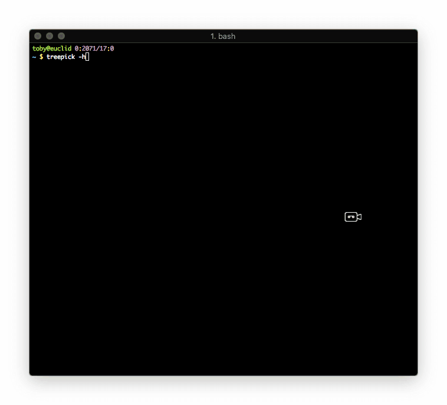

# CURSES TREE STYLE PATH PICKER

A Curses based, tree style, path picker. For use as a terminal based file dialog.



* Pre-order file system traversal from a given point, or `$PWD` if not
  specified.
* Support both Vi & Emacs bindings and jumping to next or previous parent.
* Expand or collapse child nodes one at a time or all at once.
* Recursively get disk usage of a single node or all expanded nodes.
* Toggle display of dotfiles.
* Toggle marking of files that can then be piped into another program or simply
  echoed back to the screen upon exit.
* Reset marking and expansion.

## INSTALLATION

`pip install treepick`

## CLI USAGE

```
USAGE: treepick [-h] [-a] [path]

Select paths from a directory tree.

POSITIONAL ARGUMENTS:
path          A valid path.

OPTIONAL ARGUMENTS:
-h, --help    Show this help message and exit.
-a, --hidden  Show all hidden paths too.
```

## PYTHON USAGE

```python
from treepick import pick

hidden = True

parent_path = '/path/to/directory'

my_list_of_paths = pick(parent_path, hidden)

my_amazing_function(my_list_of_paths)
```

## KEYBINDINGS

| KEY                | ACTION                                                |
| :----------------- | :---------------------------------------------------- |
| UP, k              | Step up one line.                                     |
| DOWN, j            | Step down one line.                                   |
| K                  | Jump to previous parent directory.                    |
| J                  | Jump to next parent directory.                        |
| PGDN, f            | Jump down a page of lines.                            |
| PGUP, b            | Jump up a page of lines.                              |
| HOME, g            | Jump to first line.                                   |
| END, G             | Jump to last line.                                    |
| RIGHT, l           | Expand and step into directory.                       |
| TAB, RET           | Toggle expansion/collapse of directory.               |
| LEFT, h            | Collapse directory.                                   |
| SHIFT RIGHT, L     | Expand directory and child directories.               |
| SHIFT LEFT, H      | Jump to parent directory and collapse all.            |
| SPC                | Toggle picking of paths.                              |
| v                  | Toggle picking of all currently expanded paths.       |
| :                  | Toggle picking based on entered globs.                |
| /                  | Search for substring in currently expanded paths.     |
| n                  | Jump to next occurrence of search string.             |
| N                  | Jump to previous occurrence of search string.         |
| :                  | Toggle picking of all currently expanded paths.       |
| p                  | View all currently picked paths.                      |
| .                  | Toggle display of dotfiles.                           |
| s                  | Display total size of path, recursively               |
| S                  | Display totol size of all currently expanded paths.   |
| F5, r              | Reset marking and expansion.                          |
| F1, ?              | View all keybindings.                                 |
| q, ESC             | Quit and display all marked paths.                    |

## TODO

- [x] ~~Support window resizing.~~
- [x] ~~Page for viewing all current picks~~
- [x] ~~Fix permission exception handling in my du package.~~
- [x] ~~Retain traversal position when toggling hidden directories.~~
- [ ] Different colors for sizes and marks.
